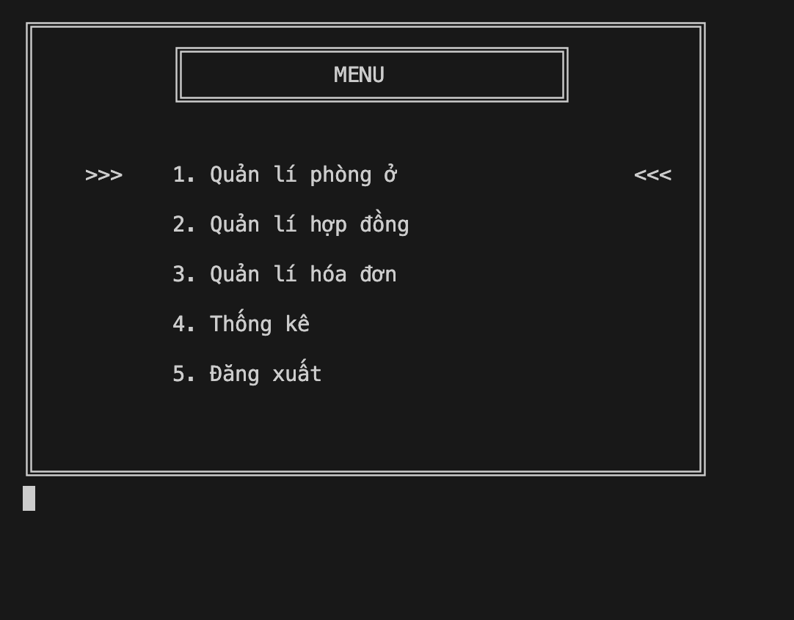
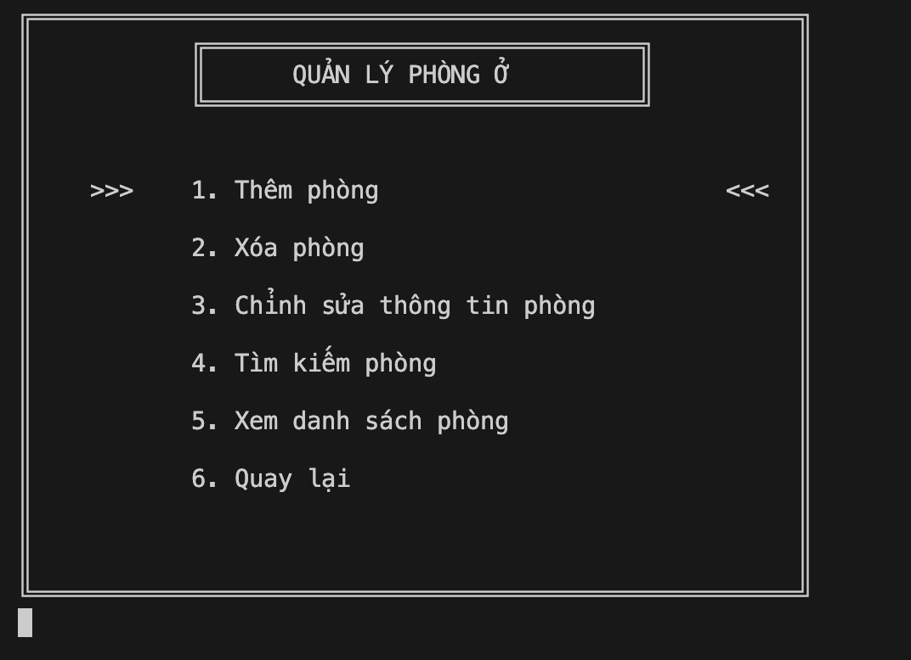
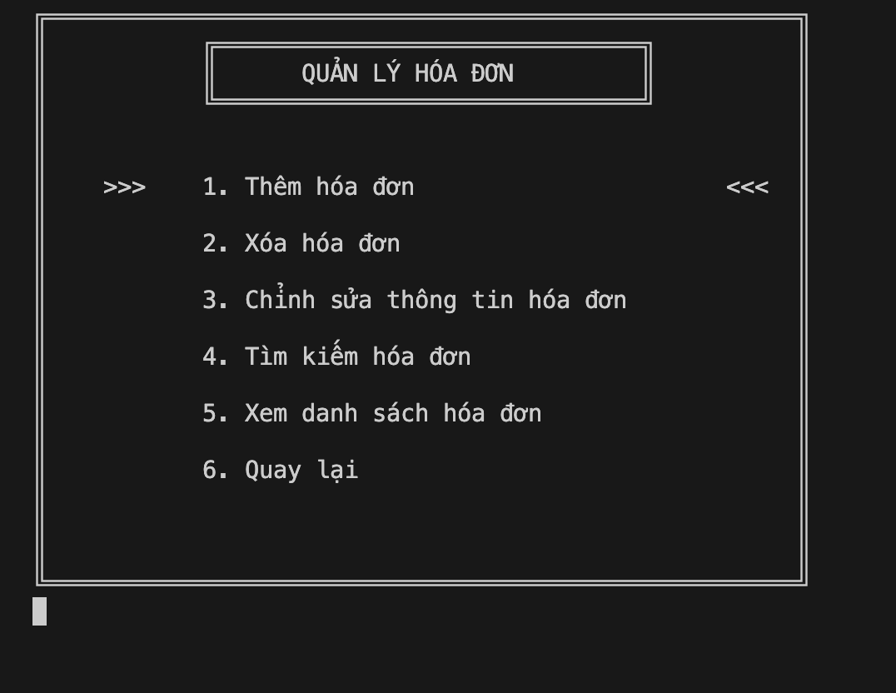
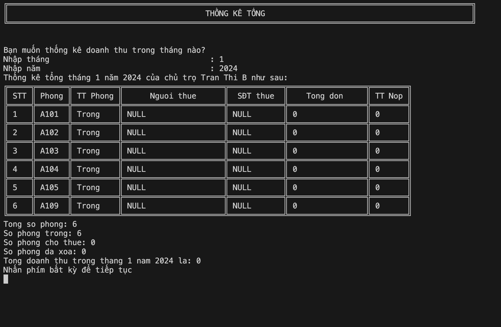
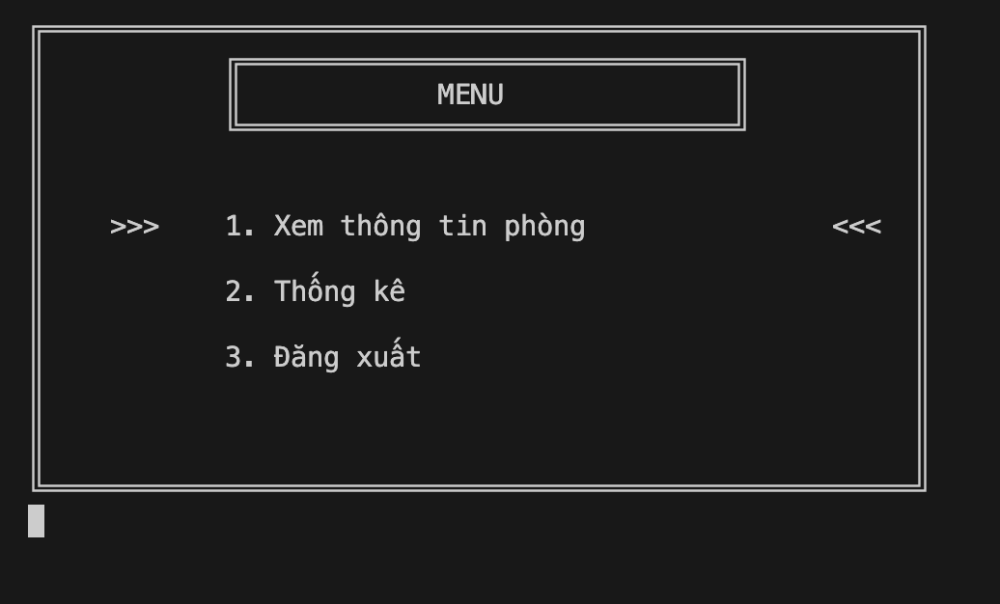
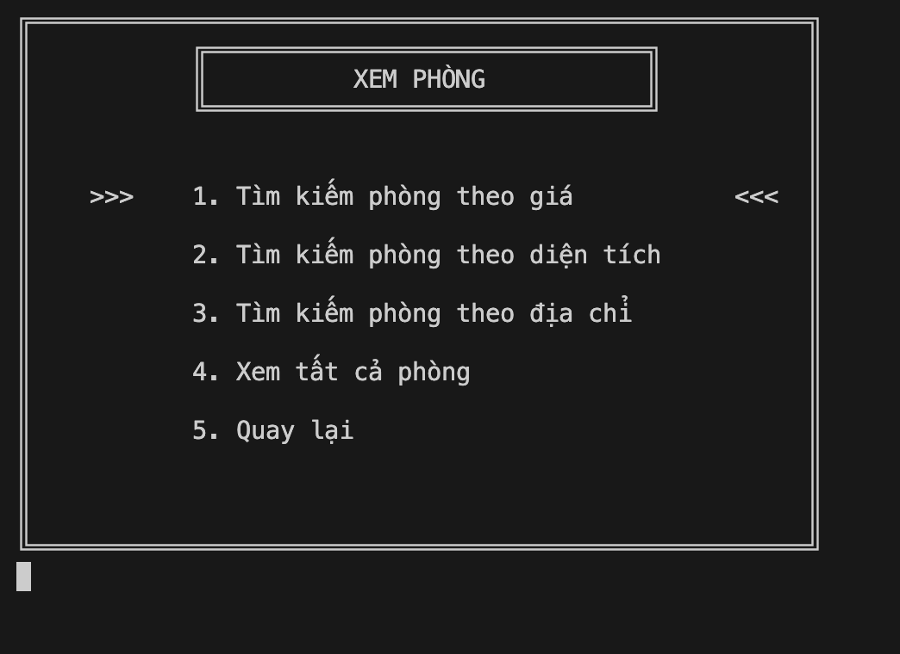
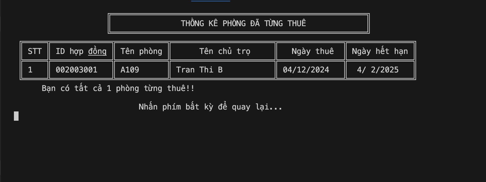

# Room Rental Management System

## Introduction
The Room Rental Management System is a C++ application designed to help landlords and tenants manage activities related to room rental. The application provides a simple, user-friendly command-line interface with all necessary features.

## Design Model
The project uses an object-oriented model with main classes: Person, Landlord, Tenant, Room, Contract, and Invoice.

## Features

### For Landlords:
- Manage room information (add, edit, delete)
- Manage rental contracts
- Manage invoices and payments
- View revenue statistics
- Manage tenant information

### For Tenants:
- Find suitable rooms
- View contract information
- Track and pay invoices
- Update personal information

## Project Structure

```
PBL2/
├── main.cpp              # Main program file
├── QLPT.h/.cpp           # Main management class
├── nguoi.h/.cpp          # Person class (base class)
├── chu_tro.h/.cpp        # Landlord class
├── nguoi_thue.h/.cpp     # Tenant class
├── phong_tro.h/.cpp      # Room class
├── hop_dong.h/.cpp       # Contract class
├── hoa_don.h/.cpp        # Invoice class
├── account.txt           # Account information storage
├── chu_tro.txt           # Landlord information storage
├── nguoi_thue.txt        # Tenant information storage
├── phong_tro.txt         # Room information storage
├── hop_dong.txt          # Contract information storage
└── hoa_don.txt           # Invoice information storage
```

## System Requirements
- Operating System: Windows, macOS, or Linux
- Compiler: g++ or equivalent supporting C++11
- Memory: Minimum 512MB RAM
- Storage: Minimum 10MB

## Installation Guide

### On Windows
1. Install MinGW or MSYS2 to get g++ compiler
2. Clone the repository: `git clone https://github.com/Baotrh8805/PBL2.git`
3. Navigate to the directory: `cd PBL2`
4. Compile: `g++ *.cpp -o QLPT.exe`
5. Run the program: `QLPT.exe`

### On macOS/Linux
1. Ensure g++ compiler is installed
2. Clone the repository: `git clone https://github.com/Baotrh8805/PBL2.git`
3. Navigate to the directory: `cd PBL2`
4. Compile: `g++ *.cpp -o QLPT`
5. Run the program: `./QLPT`

## How to Use
1. Start the program
2. Log in as a landlord or tenant
3. Follow the menu instructions to use the features

## Program Interface

### Admin User Interface (Landlord)

#### Admin Home Page


#### Room Management


#### Contract Management


#### Invoice Management


#### Revenue Statistics


### User Interface (Tenant)

#### Tenant Home Page


#### View Room Information


#### Payment Statistics


## Authors
- Nguyen Thi Thi
- Tran Hoang Bao

## License
© 2025 - PBL2 Learning Project
