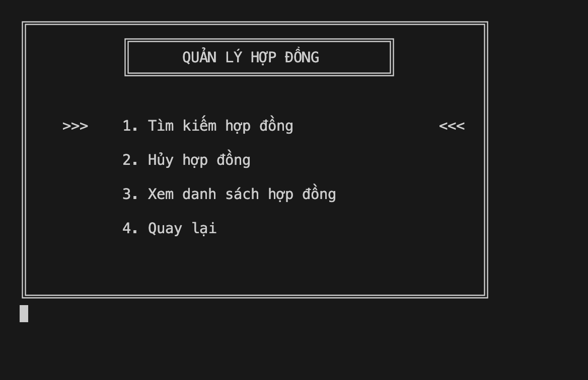

# Room Rental Management System

## Introduction
The Room Rental Management System is a C++ application designed to help landlords and tenants manage activities related to room rental. The application provides a simple, user-friendly command-line interface with all necessary features.

## Recent Updates
- **Organized Project Structure**: All files have been organized into appropriate directories for better maintainability
- **Improved Build System**: Updated compilation instructions to work with the new directory structure
- **Data File Management**: All data files (.txt) moved to dedicated `data/` directory
- **Clean Separation**: Source files, headers, and executables properly separated

## Design Model
The project uses an object-oriented model with main classes: Person, Landlord, Tenant, Room, Contract, and Invoice.

## Features

### For Landlords:
- Manage room information (add, edit, delete)
- Manage rental contracts
- Manage invoices and payments
- View revenue statistics
- Manage tenant information

### For Tenants:
- Find suitable rooms
- View contract information
- Track and pay invoices
- Update personal information

## Project Structure

```
PBL2/
├── README.md                    # Project documentation
├── bin/                         # Executable files
│   ├── main                     # Main executable
│   ├── main.exe                 # Windows executable
│   └── QLPT                     # Alternative executable
├── src/                         # Source code files
│   ├── main.cpp                 # Main program file
│   ├── QLPT.cpp                 # Main management class implementation
│   ├── nguoi.cpp                # Person class implementation
│   ├── chu_tro.cpp              # Landlord class implementation
│   ├── nguoi_thue.cpp           # Tenant class implementation
│   ├── phong_tro.cpp            # Room class implementation
│   ├── hop_dong.cpp             # Contract class implementation
│   └── hoa_don.cpp              # Invoice class implementation
├── include/                     # Header files
│   ├── QLPT.h                   # Main management class header
│   ├── nguoi.h                  # Person class header (base class)
│   ├── chu_tro.h                # Landlord class header
│   ├── nguoi_thue.h             # Tenant class header
│   ├── phong_tro.h              # Room class header
│   ├── hop_dong.h               # Contract class header
│   └── hoa_don.h                # Invoice class header
├── data/                        # Data storage files
│   ├── account.txt              # Account information storage
│   ├── chu_tro.txt              # Landlord information storage
│   ├── nguoi_thue.txt           # Tenant information storage
│   ├── phong_tro.txt            # Room information storage
│   ├── hop_dong.txt             # Contract information storage
│   └── hoa_don.txt              # Invoice information storage
├── images/                      # Screenshot images
│   ├── admin-home.png
│   ├── admin-ql_phong.png
│   ├── admin-ql_hop_dong.png
│   ├── admin-ql_hoa_don.png
│   ├── admin-thong-ke.png
│   ├── user-home.png
│   ├── user-xem_phong.png
│   └── user-thongke.png
└── docs/                        # Additional documentation
```

## System Requirements
- Operating System: Windows, macOS, or Linux
- Compiler: g++ or equivalent supporting C++11
- Memory: Minimum 512MB RAM
- Storage: Minimum 10MB

## Installation Guide

### On Windows
1. Install MinGW or MSYS2 to get g++ compiler
2. Clone the repository: `git clone https://github.com/Baotrh8805/PBL2.git`
3. Navigate to the directory: `cd PBL2`
4. Compile the program: `g++ -I./include -o bin/main src/*.cpp`
5. Run the program: `bin/main.exe` (or `./bin/main` on Git Bash)

### On macOS/Linux
1. Ensure g++ compiler is installed
2. Clone the repository: `git clone https://github.com/Baotrh8805/PBL2.git`
3. Navigate to the directory: `cd PBL2`
4. Compile the program: `g++ -I./include -o bin/main src/*.cpp`
5. Run the program: `./bin/main`

### Build Instructions
The project uses a modular structure with separate directories for source files, headers, and data. 
To compile successfully:
- Use the `-I./include` flag to specify the header directory
- Compile all source files in the `src/` directory
- The executable will be created in the `bin/` directory
- Data files in the `data/` directory will be automatically loaded during runtime

## How to Use
1. Start the program
2. Log in as a landlord or tenant
3. Follow the menu instructions to use the features

## Program Interface

### Admin User Interface (Landlord)

#### Admin Home Page


#### Room Management


#### Contract Management


#### Invoice Management


#### Revenue Statistics


### User Interface (Tenant)

#### Tenant Home Page


#### View Room Information


#### Payment Statistics


## Authors
- Nguyen Thi Thi
- Tran Hoang Bao

## License
© 2025 - PBL2 Learning Project
